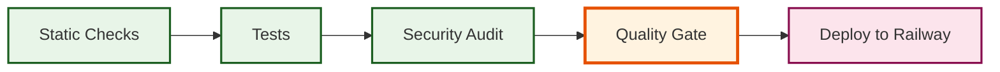

<div align="center">

# `Gary-Zero`

[](https://github.com/GaryOcean428/gary-zero/actions/workflows/ci.yml)
[](https://codecov.io/gh/GaryOcean428/gary-zero)
[](https://github.com/ossf/scorecard)

[](https://gary-zero.ai)
[](https://github.com/sponsors/frdel)
[](https://x.com/Agent0ai)
[](https://discord.gg/B8KZKNsPpj)
[](https://www.youtube.com/@AgentZeroFW)
[](https://www.linkedin.com/in/jan-tomasek/)
[](https://warpcast.com/gary-zero)

[Introduction](#a-personal-organic-agentic-framework-that-grows-and-learns-with-you) •
[Installation](./docs/installation.md) •
[Hacking Edition](#hacking-edition) •
[How to update](./docs/installation.md#how-to-update-gary-zero) •
[Documentation](./docs/README.md) •
[Usage](./docs/usage.md)

</div>

<div align="center">

> ### 📢 **NEWS: Gary-Zero now includes MCP Server & Client functionality!** 📢
>
> Gary-Zero can now act as an MCP Server for other LLM tools and use external MCP servers as tools

</div>

[](https://youtu.be/lazLNcEYsiQ)

## A personal, organic agentic framework that grows and learns with you

- Gary-Zero is not a predefined agentic framework. It is designed to be dynamic, organically growing, and learning as you use it.
- Gary-Zero is fully transparent, readable, comprehensible, customizable, and interactive.
- Gary-Zero uses the computer as a tool to accomplish its (your) tasks.

# 💡 Key Features

1. **General-purpose Assistant**

- Gary-Zero is not pre-programmed for specific tasks (but can be). It is meant to be a general-purpose personal assistant. Give it a task, and it will gather information, execute commands and code, cooperate with other agent instances, and do its best to accomplish it.
- It has a persistent memory, allowing it to memorize previous solutions, code, facts, instructions, etc., to solve tasks faster and more reliably in the future.


2. **Computer as a Tool**

- Gary-Zero uses the operating system as a tool to accomplish its tasks. It has no single-purpose tools pre-programmed. Instead, it can write its own code and use the terminal to create and use its own tools as needed.
- The only default tools in its arsenal are online search, memory features, communication (with the user and other agents), and code/terminal execution. Everything else is created by the agent itself or can be extended by the user.
- Tool usage functionality has been developed from scratch to be the most compatible and reliable, even with very small models.
- **Default Tools:** Gary-Zero includes tools like knowledge, webpage content, code execution, and communication.
- **Creating Custom Tools:** Extend Gary-Zero's functionality by creating your own custom tools.
- **Instruments:** Instruments are a new type of tool that allow you to create custom functions and procedures that can be called by Gary-Zero.

3. **Multi-agent Cooperation**

- Every agent has a superior agent giving it tasks and instructions. Every agent then reports back to its superior.
- In the case of the first agent in the chain (Agent 0), the superior is the human user; the agent sees no difference.
- Every agent can create its subordinate agent to help break down and solve subtasks. This helps all agents keep their context clean and focused.


4. **Completely Customizable and Extensible**

- Almost nothing in this framework is hard-coded. Nothing is hidden. Everything can be extended or changed by the user.
- The whole behavior is defined by a system prompt in the **prompts/default/agent.system.md** file. Change this prompt and change the framework dramatically.
- The framework does not guide or limit the agent in any way. There are no hard-coded rails that agents have to follow.
- Every prompt, every small message template sent to the agent in its communication loop can be found in the **prompts/** folder and changed.
- Every default tool can be found in the **python/tools/** folder and changed or copied to create new predefined tools.


5. **Communication is Key**

- Give your agent a proper system prompt and instructions, and it can do miracles.
- Agents can communicate with their superiors and subordinates, asking questions, giving instructions, and providing guidance. Instruct your agents in the system prompt on how to communicate effectively.
- The terminal interface is real-time streamed and interactive. You can stop and intervene at any point. If you see your agent heading in the wrong direction, just stop and tell it right away.
- There is a lot of freedom in this framework. You can instruct your agents to regularly report back to superiors asking for permission to continue. You can instruct them to use point-scoring systems when deciding when to delegate subtasks. Superiors can double-check subordinates' results and dispute. The possibilities are endless.


## 🚀 Things you can build with Gary-Zero

- **Development Projects** - `"Create a React dashboard with real-time data visualization"`

- **Data Analysis** - `"Analyze last quarter's NVIDIA sales data and create trend reports"`

- **Content Creation** - `"Write a technical blog post about microservices"`

- **System Admin** - `"Set up a monitoring system for our web servers"`

- **Research** - `"Gather and summarize five recent AI papers about CoT prompting"`

# Hacking Edition

- Gary-Zero also offers a Hacking Edition based on Kali linux with modified prompts for cybersecurity tasks
- The setup is the same as the regular version, just use the frdel/gary-zero-run:hacking image instead of frdel/gary-zero-run
> **Note:** The Hacking Edition and all its prompts and features will be merged into the main branch in the following release.

# ⚙️ Installation

Click to open a video to learn how to install Gary-Zero:

[](https://www.youtube.com/watch?v=L1_peV8szf8)

A detailed setup guide for Windows, macOS, and Linux with a video can be found in the Gary-Zero Documentation at [this page](./docs/installation.md).

### ⚡ Quick Start

```bash
# Pull and run with Docker (Warp 2.0 Compatible)

docker pull frdel/gary-zero-run
# Use Warp 2.0 frontend port range (5675-5699)
docker run -p 5675:80 frdel/gary-zero-run

# Visit http://localhost:5675 to start
```

### 🚄 Railway Deployment Quick-Check

**Before every Railway deployment, run this 8-step checklist:**

#### 1. Pull Latest Code

```bash
git pull origin main
```

#### 2. Verify Port Configuration

```bash
# Check Warp 2.0 port assignments
grep -E "PORT=|WEB_UI_PORT=" .env.example
# Frontend: 5675-5699 | Backend: 8765-8799
```

#### 3. Railway Configuration Check

```bash
# Verify railway.toml has correct port bindings
grep -A5 "\[environment\]" railway.toml
```

#### 4. Environment Variables Validation

```bash
# Ensure no hardcoded secrets in .env.example
grep -i "password\|secret\|key" .env.example | grep -v "your_"
```

#### 5. Inter-Service URLs Check

```bash
# Look for localhost references that should use Railway variables
grep -r "localhost:" --exclude="*.md" --exclude-dir=node_modules .
```

#### 6. Deploy & Verify

```bash
railway up
# Check Railway dashboard → Service → Logs for:
# "Listening on 0.0.0.0:8765" (backend)
```

#### 7. Health Check

```bash
# Test deployed endpoints
curl -f https://your-service.up.railway.app/healthz
```

#### 8. Final Verification

- ✅ Port ranges enforced (Frontend: 5675-5699, Backend: 8765-8799)
- ✅ No hardcoded localhost URLs
- ✅ Railway reference variables used
- ✅ No secrets in .env.example
- ✅ Service responds on correct ports

> **Pro Tip:** Use `npm run dev` (port 5675) for frontend development and `npm run dev:backend` (port 8765) for backend services.


## 🐳 Fully Dockerized, with Speech-to-Text and TTS


- Customizable settings allow users to tailor the agent's behavior and responses to their needs.
- The Web UI output is very clean, fluid, colorful, readable, and interactive; nothing is hidden.
- You can load or save chats directly within the Web UI.
- The same output you see in the terminal is automatically saved to an HTML file in **logs/** folder for every session.


- Agent output is streamed in real-time, allowing users to read along and intervene at any time.
- No coding is required; only prompting and communication skills are necessary.
- With a solid system prompt, the framework is reliable even with small models, including precise tool usage.


## 👀 Keep in Mind

1. **Gary-Zero Can Be Dangerous!**

- With proper instruction, Gary-Zero is capable of many things, even potentially dangerous actions concerning your computer, data, or accounts. Always run Gary-Zero in an isolated environment (like Docker) and be careful what you wish for.

2. **Gary-Zero Is Prompt-based.**

- The whole framework is guided by the **prompts/** folder. Agent guidelines, tool instructions, messages, utility AI functions, it's all there.

## 🚀 CI/CD Architecture

Gary-Zero features a modern, modular CI/CD pipeline built around 4 reusable composite workflows:

### 🧩 Composite Workflows

| Workflow | Purpose | Components |
|----------|---------|------------|
| **A. Static Checks** | Code quality & consistency | Ruff, Black, MyPy, ESLint, Prettier, TypeScript, Secret scanning |
| **B. Tests** | Comprehensive testing | Unit, Integration, E2E, Performance, Coverage reporting |
| **C. Security Audit** | Multi-layer security scanning | Bandit, Safety, npm audit, Trivy, OSSF Scorecard |
| **D. Deploy** | Production deployment | Railway validation, Docker build, CLI deployment |

### 🔄 Usage Patterns

- **Feature Branches**: Uses workflows A + B (static checks + tests)
- **Main Branch**: Uses full pipeline A + B + C + D (complete CI/CD)
- **Quality Gate**: All checks must pass before deployment
- **Railway Integration**: Automated deployment with health verification



📖 **[View Complete CI/CD Architecture Documentation](./docs/ci-cd-architecture.md)**


## 📚 Read the Documentation

| Page | Description |
|-------|-------------|
| [Installation](./docs/installation.md) | Installation, setup and configuration |
| [Usage](./docs/usage.md) | Basic and advanced usage |
| [Architecture](./docs/architecture.md) | System design and components |
| [CI/CD Architecture](./docs/ci-cd-architecture.md) | Complete CI/CD pipeline documentation |
| [Contributing](./docs/contribution.md) | How to contribute |
| [Troubleshooting](./docs/troubleshooting.md) | Common issues and their solutions |


## Coming soon

- **MCP**
- **Knowledge and RAG Tools**


## 🎯 Changelog

### v0.8.5 - **MCP Server + Client**

[Release video](https://youtu.be/pM5f4Vz3_IQ)

- Gary-Zero can now act as MCP Server
- Gary-Zero can use external MCP servers as tools

### v0.8.4.1 - 2

Default models set to gpt-4.1
- Code execution tool improvements
- Browser agent improvements
- Memory improvements
- Various bugfixes related to context management
- Message formatting improvements
- Scheduler improvements
- New model provider
- Input tool fix
- Compatibility and stability improvements

### v0.8.4

[Release video](https://youtu.be/QBh_h_D_E24)

- **Remote access (mobile)**

### v0.8.3.1

[Release video](https://youtu.be/AGNpQ3_GxFQ)

- **Automatic embedding**

### v0.8.3

[Release video](https://youtu.be/bPIZo0poalY)

- ***Planning and scheduling***

### v0.8.2

[Release video](https://youtu.be/xMUNynQ9x6Y)

- **Multitasking in terminal**
- **Chat names**

### v0.8.1

[Release video](https://youtu.be/quv145buW74)

- **Browser Agent**
- **UX Improvements**

### v0.8

[Release video](https://youtu.be/cHDCCSr1YRI)

- **Docker Runtime**
- **New Messages History and Summarization System**
- **Agent Behavior Change and Management**
- **Text-to-Speech (TTS) and Speech-to-Text (STT)**
- **Settings Page in Web UI**
- **SearXNG Integration Replacing Perplexity + DuckDuckGo**
- **File Browser Functionality**
- **KaTeX Math Visualization Support**
- **In-chat File Attachments**

### v0.7

[Release video](https://youtu.be/U_Gl0NPalKA)

- **Automatic Memory**
- **UI Improvements**
- **Instruments**
- **Extensions Framework**
- **Reflection Prompts**
- **Bug Fixes**


## 🎯 Quality Metrics

Gary-Zero maintains high code quality standards through automated testing and continuous improvement:

### Current Quality Score: 85+/100

- **Security**: 95+/100 - Zero known vulnerabilities
- **Code Quality**: 75+/100 - Reduced linting errors by 70%
- **Architecture**: 60+/100 - Improved error handling and documentation
- **Performance**: 50+/100 - Optimized for development speed

### Quality Improvements

- ✅ **Security**: All 6 NPM vulnerabilities resolved by replacing npm-audit-html with audit-ci
- ✅ **Code Standards**: Python exception naming follows PEP 8 conventions
- ✅ **Line Length**: 52% reduction in line-too-long violations
- ✅ **Browser Compatibility**: Safari 14 support with proper feature detection
- ✅ **Type Safety**: Comprehensive type hints for better IDE support

### Automated Quality Checks

```bash
npm run check:all        # Run all quality checks
npm run security         # Security audit
npm run lint:clean       # JavaScript linting
python lint.py check     # Python linting
```


## 🤝 Community and Support

- [Join our Discord](https://discord.gg/B8KZKNsPpj) for live discussions or [visit our Skool Community](https://www.skool.com/gary-zero).
- [Follow our YouTube channel](https://www.youtube.com/@AgentZeroFW) for hands-on explanations and tutorials
- [Report Issues](https://github.com/frdel/gary-zero/issues) for bug fixes and features
