# Gary-Zero CI/CD Architecture

## Overview

Gary-Zero uses a modular CI/CD architecture built around 4 reusable composite workflows that can be mixed and matched based on the deployment scenario.

## Architecture Diagram

```mermaid
graph TB
    subgraph "🔄 Trigger Events"
        FP[Feature Branch Push]
        PR[Pull Request]
        MP[Main Branch Push]
        WD[Workflow Dispatch]
    end

    subgraph "🎯 Workflow Selection"
        FB[Feature Branch Workflow]
        MB[Main Branch Workflow]
    end

    subgraph "🧩 Composite Workflows (Reusable)"
        subgraph "A: Static Checks"
            A1[Python Linting<br/>• Ruff<br/>• Black<br/>• MyPy]
            A2[Node.js Linting<br/>• ESLint<br/>• Prettier<br/>• TypeScript]
            A3[Secret Scanning<br/>• detect-secrets]
        end

        subgraph "B: Tests"
            B1[Unit Tests<br/>• Framework<br/>• API<br/>• Security<br/>• Plugins]
            B2[Integration Tests<br/>• API Bridge<br/>• Multi-Agent<br/>• Session Mgmt]
            B3[E2E Tests<br/>• Python/Pytest<br/>• JavaScript/Vitest]
            B4[Coverage Merge<br/>• Combined Reports<br/>• Codecov Upload]
        end

        subgraph "C: Security Audit"
            C1[Python Security<br/>• Bandit<br/>• Safety<br/>• pip-audit]
            C2[Node.js Security<br/>• npm audit]
            C3[Container Security<br/>• Trivy Scanner]
            C4[OSSF Scorecard<br/>• Security Metrics]
            C5[License Check<br/>• Compliance Audit]
        end

        subgraph "D: Deploy"
            D1[Deployment Validation<br/>• Railway Config<br/>• Railpack Validation<br/>• Health Endpoint]
            D2[Docker Build & Push<br/>• Multi-platform<br/>• Registry Push<br/>• Image Testing]
            D3[Railway Deployment<br/>• CLI Deploy<br/>• Health Verification<br/>• URL Extraction]
        end
    end

    subgraph "🚪 Quality Gate"
        QG[Quality Gate<br/>All checks must pass<br/>before deployment]
    end

    subgraph "🎯 Deployment Targets"
        PROD[Production<br/>railway.app]
        STAGE[Staging<br/>railway.app]
    end

    subgraph "📊 Outputs & Artifacts"
        COV[Coverage Reports]
        SEC[Security Reports]
        LOGS[Deployment Logs]
        REL[GitHub Releases]
        DOCK[Docker Registry]
    end

    %% Trigger flows
    FP --> FB
    PR --> FB
    MP --> MB
    WD --> MB

    %% Feature branch flow (A + B)
    FB --> A1
    FB --> A2
    FB --> A3
    FB --> B1
    FB --> B2
    FB --> B3
    FB --> B4

    %% Main branch flow (A + B + C + D)
    MB --> A1
    MB --> A2
    MB --> A3
    MB --> B1
    MB --> B2
    MB --> B3
    MB --> B4
    MB --> C1
    MB --> C2
    MB --> C3
    MB --> C4
    MB --> C5
    
    %% Quality gate
    A1 --> QG
    A2 --> QG
    A3 --> QG
    B1 --> QG
    B2 --> QG
    B3 --> QG
    B4 --> QG
    C1 --> QG
    C2 --> QG
    C3 --> QG
    C4 --> QG
    C5 --> QG

    %% Deployment flow
    QG --> D1
    D1 --> D2
    D2 --> D3
    D3 --> PROD
    D3 --> STAGE

    %% Outputs
    B4 --> COV
    C1 --> SEC
    C2 --> SEC
    C3 --> SEC
    D2 --> DOCK
    D3 --> LOGS
    D3 --> REL

    %% Styling
    classDef triggerNode fill:#e1f5fe,stroke:#01579b,stroke-width:2px
    classDef workflowNode fill:#f3e5f5,stroke:#4a148c,stroke-width:2px
    classDef compositeNode fill:#e8f5e8,stroke:#1b5e20,stroke-width:2px
    classDef gateNode fill:#fff3e0,stroke:#e65100,stroke-width:3px
    classDef deployNode fill:#fce4ec,stroke:#880e4f,stroke-width:2px
    classDef outputNode fill:#f1f8e9,stroke:#33691e,stroke-width:2px

    class FP,PR,MP,WD triggerNode
    class FB,MB workflowNode
    class A1,A2,A3,B1,B2,B3,B4,C1,C2,C3,C4,C5,D1,D2,D3 compositeNode
    class QG gateNode
    class PROD,STAGE deployNode
    class COV,SEC,LOGS,REL,DOCK outputNode
```



## Composite Workflow Details

### A. Static Checks (`_static-checks.yml`)
**Purpose**: Code quality and consistency validation
- **Python Analysis**: Ruff linting, Black formatting, MyPy type checking
- **Node.js Analysis**: ESLint, Prettier formatting, TypeScript compilation
- **Security**: Secret detection with detect-secrets
- **Outputs**: Lint status, formatting compliance

### B. Tests (`_tests.yml`)
**Purpose**: Comprehensive testing and coverage analysis
- **Unit Tests**: Framework, API, security, plugins (parallel execution)
- **Integration Tests**: API bridge, multi-agent, session management
- **E2E Tests**: Python (Pytest) and JavaScript (Vitest) end-to-end testing
- **Performance Tests**: Benchmark execution with pytest-benchmark
- **Coverage Merge**: Combined coverage reports with Codecov integration
- **Outputs**: Test results, coverage metrics, performance benchmarks

### C. Security Audit (`_security-audit.yml`)
**Purpose**: Multi-layered security scanning and compliance
- **Python Security**: Bandit static analysis, Safety vulnerability scanning, pip-audit
- **Node.js Security**: npm audit for dependency vulnerabilities
- **Container Security**: Trivy vulnerability scanning for Docker images
- **OSSF Scorecard**: Open source security scoring
- **License Compliance**: License compatibility checking
- **Outputs**: Security status, critical issue count, compliance reports

### D. Deploy (`_deploy.yml`)
**Purpose**: Production deployment with validation
- **Pre-deployment Validation**: Railway config, Railpack validation, health endpoints
- **Docker Operations**: Multi-platform builds, registry push, image testing
- **Railway Deployment**: CLI-based deployment, health verification, URL extraction
- **Post-deployment**: Release creation, notification system
- **Outputs**: Deployment URL, deployment status, release artifacts

## Workflow Usage Patterns

### Feature Branch Pattern (A + B)
```yaml
# Triggered by: feature branch pushes, pull requests
jobs:
  static-checks:
    uses: ./.github/workflows/_static-checks.yml
  tests:
    uses: ./.github/workflows/_tests.yml
```
- **Purpose**: Fast feedback for development
- **Coverage**: Code quality + testing
- **Duration**: ~10-15 minutes

### Main Branch Pattern (A + B + C + D)
```yaml
# Triggered by: main branch pushes, manual dispatch
jobs:
  static-checks:
    uses: ./.github/workflows/_static-checks.yml
  tests:
    uses: ./.github/workflows/_tests.yml
  security-audit:
    uses: ./.github/workflows/_security-audit.yml
  quality-gate:
    needs: [static-checks, tests, security-audit]
  deploy:
    uses: ./.github/workflows/_deploy.yml
    needs: [quality-gate]
```
- **Purpose**: Complete CI/CD pipeline
- **Coverage**: Quality + security + deployment
- **Duration**: ~25-35 minutes

## Quality Gate System

The quality gate ensures that all quality checks pass before deployment:

```mermaid
graph LR
    A[Static Checks] --> QG{Quality Gate}
    B[Tests] --> QG
    C[Security Audit] --> QG
    QG -->|✅ Pass| D[Deploy]
    QG -->|❌ Fail| E[Block Deployment]
    
    classDef passNode fill:#c8e6c9,stroke:#2e7d32
    classDef failNode fill:#ffcdd2,stroke:#c62828
    classDef gateNode fill:#fff3e0,stroke:#e65100,stroke-width:3px
    
    class D passNode
    class E failNode
    class QG gateNode
```



## Configuration Matrix

| Environment | Static Checks | Tests | Security | Deploy | Coverage Threshold |
|-------------|---------------|--------|-----------|--------|--------------------|
| Feature Branch | ✅ | ✅ | ❌ | ❌ | 75% |
| Pull Request | ✅ | ✅ | ❌ | ❌ | 75% |
| Main Branch | ✅ | ✅ | ✅ | ✅ | 80% |
| Manual Deploy | ✅ | ✅ | Optional | Optional | 80% |

## Railway Integration

### Deployment Validation
```yaml
# Railway configuration validation
- railway.toml existence and structure
- NIXPACKS builder configuration
- Build/start script validation
- Health endpoint testing
- Port configuration verification
```

### Deployment Process
```yaml
# Railway CLI deployment
1. Authentication with Railway token
2. Service selection (if specified)
3. Railway up --detach deployment
4. Health endpoint verification
5. URL extraction and validation
```

## Security Integration

### Multi-layer Security Scanning
- **Static Analysis**: Bandit for Python security issues
- **Dependency Scanning**: Safety and npm audit for vulnerabilities
- **Container Scanning**: Trivy for Docker image vulnerabilities
- **Supply Chain**: OSSF Scorecard for open source security posture
- **License Compliance**: Automated license compatibility checking

### Security Reporting
- JSON reports for all security tools
- SARIF format for GitHub Security tab integration
- Artifact retention for security audit trails
- Configurable failure thresholds

## Monitoring and Observability

### Workflow Outputs
- **Coverage Reports**: Combined XML reports uploaded to Codecov
- **Security Reports**: JSON artifacts with detailed findings
- **Performance Metrics**: Benchmark results in JSON format
- **Deployment Logs**: Complete deployment audit trail

### GitHub Integration
- **Status Checks**: Required for branch protection
- **PR Comments**: Automated result summaries
- **Security Alerts**: SARIF integration with GitHub Security
- **Releases**: Automated release creation on successful deployment

## Benefits

### 🔄 Reusability
- **Modular Design**: Mix and match composite workflows
- **Configuration Flexibility**: Parameterized inputs for different scenarios
- **Environment Agnostic**: Works across development and production

### ⚡ Performance
- **Parallel Execution**: Tests run in parallel matrices
- **Smart Caching**: Docker buildx and dependency caching
- **Fast Feedback**: Feature branch workflow completes in ~10 minutes

### 🔒 Security
- **Multi-layer Scanning**: Comprehensive security validation
- **Supply Chain Security**: OSSF Scorecard integration
- **Compliance**: License and dependency auditing

### 🚀 Deployment
- **Zero-downtime**: Railway platform deployment
- **Health Verification**: Automated health checks
- **Rollback Capability**: Docker registry versioning

This architecture provides a robust, scalable, and maintainable CI/CD pipeline that grows with the Gary-Zero project while maintaining high code quality and security standards.
